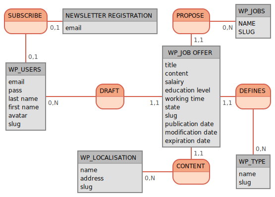

# Gestion des données avec WordPress

## Modèle conceptuel de données (MCD)

### Beauté Recrutement

---

## Entités

|           Nom           | Table WordPress |       Détail(s)       |
|:-----------------------:|:---------------:|:---------------------:|
| WP_Users                | users           | rôle user             |
| WP_Job offer            | posts           | type offre d'emploi   |
| WP_Type                 | terms           | taxonomy type         |
| WP_Localisation         | terms           | taxonomy localisation |
| WP_Jobs                 | terms           | taxonomy métiers      |
| Newsletter Registration | users           | type newsletter       |

---

## Propriétés (Attributs)

### Users

| Propriété     | Table WordPress | Colonne    | Détails             |
|---------------|-----------------|------------|---------------------|
| email         | users           | user_email |                     |
| pass          | users           | user_pass  |                     |
| last name     | usermeta        | meta_value | meta_key last_name  |
| first name    | usermeta        | meta_value | meta_key first_name |
| avatar        |                 |            | Géré par Gravatar   |
| slug          | users           | user_url   |                     |

### Job offers

| Propriété         | Table WordPress | Colonne      | Détails                  |
|-------------------|-----------------|--------------|--------------------------|
| title             | posts           | post_title   |                          |
| content           | posts           | post_content |                          |
| salairy           | postmeta        | meta_value   | meta_key salary          |
| educationLevel    | postmeta        | meta_value   | meta_key education_level |
| workingTime       | postmeta        | meta_value   | meta_key working_time    |
| state             | posts           | post_status  |                          |
| slug              | posts           | post_url     |                          |
| publicationDate   | posts           | post_date    |                          |
| modificationDate  | posts           | post_date    |                          |
| expirationDate    | postmeta        | meta_value   | meta_key expiration      |

### Type

| Propriété | Table WordPress | Colonne | Détails |
|-----------|-----------------|---------|---------|
| name      | terms           | name    |         |
| slug      | terms           | slug    |         |

### Localisation

| Propriété      | Table WordPress | Colonne    | Détails         |
|----------------|-----------------|------------|-----------------|
| name           | terms           | name       |                 |
| address        | termsmeta       | meta_value | meta_key adress |
| slug           | terms           | slug       |                 |

### Jobs

| Propriété | Table WordPress | Colonne | Détails |
|-----------|-----------------|---------|---------|
| name      | terms           | name    |         |
| slug      | terms           | slug    |         |

### Newsletter Registration

| Propriété | Table WordPress |   Colonne  | Détails |
|:---------:|:---------------:|:----------:|---------|
| email     | users           | user_email |         |

---

## Associations

|   Entité 1   |    Nom    |         Entité 2        |   Table WordPress  | Colonne entité 1 | Colonne entité 2 | Détail(s) |
|:------------:|:---------:|:-----------------------:|:------------------:|:----------------:|:----------------:|:---------:|
| WP_TYPE      | defines   | WP_JOB OFFER            | term_relationships | term_taxonomy_id | object_id        |           |
| WP_JOB OFFER | content   | WP_LOCALISATION         | term_relationships | object_id        | term_taxonomy_id |           |
| WP_JOB OFFER | propose   | WP_JOBS                 | term_relationships | object_id        | term_taxonomy_id |           |
| WP_USERS     | draft     | WP_JOB OFFER            | posts              | post_author      | ID               |           |
| WP_USERS     | subscribe | NEWSLETTER REGISTRATION | users              | user_email       | ID               |           |